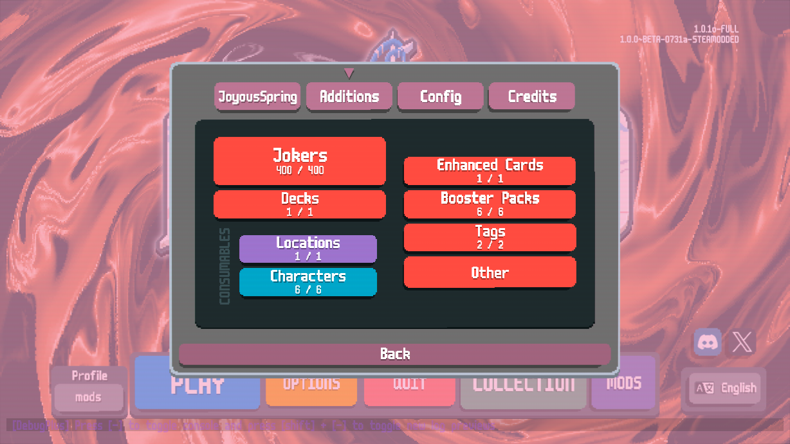

# JoyousSpring - Balatro Mod

Adds modern Yu-Gi-Oh! cards and mechanics.

## Installation

1. Install [Steamodded](https://github.com/Steamopollys/Steamodded) [(version >1.0.0)](https://github.com/Steamodded/smods/wiki)
2. Download the [latest release](https://github.com/nh6574/JoyousSpring/releases)
3. Extract the zip file into its own folder inside your Balatro mods folder (%appdata%\Balatro\Mods)

Make sure to check the Glossary and the Config in Main Menu > Mods > JoyousSpring

Check out the [Discord](https://discord.gg/Ac5FKpQCRV) for troubleshooting and chatting about the mod <3

## Known Issues and future ideas

- Still very much WIP
- Extra Deck and summon material selection doesn't work properly with a controller
- It hasn't been tested with other mods (other than JokerDisplay) so it might not play well with them

## Screenshots

## Currently implemented

|||||||
|--|--|--|--|--|--|
| [Dragonmaid](https://balatromods.miraheze.org/wiki/JoyousSpring/Jokers/Dragonmaid)| [Live☆Twin](https://balatromods.miraheze.org/wiki/JoyousSpring/Jokers/LiveTwin)| [Dogmatika](https://balatromods.miraheze.org/wiki/JoyousSpring/Jokers/Dogmatika)| [Ghost Girls](https://balatromods.miraheze.org/wiki/JoyousSpring/Jokers/Ghost_Girls)| [Spright](https://balatromods.miraheze.org/wiki/JoyousSpring/Jokers/Spright)| [Mekk-Knight](https://balatromods.miraheze.org/wiki/JoyousSpring/Jokers/Mekk-Knight)|
| [Generaider](https://balatromods.miraheze.org/wiki/JoyousSpring/Jokers/Generaider)| [Ghoti](https://balatromods.miraheze.org/wiki/JoyousSpring/Jokers/Ghoti)| [PSY-Frame](https://balatromods.miraheze.org/wiki/JoyousSpring/Jokers/PSY-Frame)| [Runick](https://balatromods.miraheze.org/wiki/JoyousSpring/Jokers/Runick)| [Burning Abyss](https://balatromods.miraheze.org/wiki/JoyousSpring/Jokers/Burning_Abyss)| [Labrynth](https://balatromods.miraheze.org/wiki/JoyousSpring/Jokers/Labrynth)|
| [Subterror](https://balatromods.miraheze.org/wiki/JoyousSpring/Jokers/Subterror)| [Eldlich](https://balatromods.miraheze.org/wiki/JoyousSpring/Jokers/Eldlich)| [@Ignister](https://balatromods.miraheze.org/wiki/JoyousSpring/Jokers/@Ignister)| [Solfachord](https://balatromods.miraheze.org/wiki/JoyousSpring/Jokers/Solfachord)| [Witchcrafter](https://balatromods.miraheze.org/wiki/JoyousSpring/Jokers/Witchcrafter)| [Shaddoll](https://balatromods.miraheze.org/wiki/JoyousSpring/Jokers/Shaddoll)|
| [Paleozoic](https://balatromods.miraheze.org/wiki/JoyousSpring/Jokers/Paleozoic)| [Invoked](https://balatromods.miraheze.org/wiki/JoyousSpring/Jokers/Invoked)| [Danger!](https://balatromods.miraheze.org/wiki/JoyousSpring/Jokers/Danger!)| [Adamancipator](https://balatromods.miraheze.org/wiki/JoyousSpring/Jokers/Adamancipator)| [Virtual World](https://balatromods.miraheze.org/wiki/JoyousSpring/Jokers/Virtual_World)| [Flower Cardian](https://balatromods.miraheze.org/wiki/JoyousSpring/Jokers/Flower_Cardian)|
| [Fortune Lady](https://balatromods.miraheze.org/wiki/JoyousSpring/Jokers/Fortune_Lady)||||| [Free Agents](https://balatromods.miraheze.org/wiki/JoyousSpring/Jokers/Free_Agents)|

## Recommended mods:
### Mods with native support:
* [JokerDisplay](https://github.com/nh6574/JokerDisplay) - Adds information under Jokers so you don't have to hover them. This mod adds native support. (Made by me too!)
* [TheFamily](https://github.com/SleepyG11/TheFamilyBalatro) - Adds extra tabs to the side to save space on the screen. This mod adds native support (might add exclusive features in the future so it's recommended)
* [CardSleeves](https://github.com/larswijn/CardSleeves) - Adds sleeves to decks for extra effects. This mod adds some.
* [Handy](https://github.com/SleepyG11/HandyBalatro) - Adds QoL controls to the game. This mods supports some features natively.
* [Unjankify](https://github.com/blazingulag/Unjankify) - Fixes some issues when playing with multiple mods like cardarea overlap. Includes JoyousSpring support.

### Other mods:
* [Galdur](https://github.com/Eremel/Galdur) - Nicer deck selection (Highly Recommended)
* [Glue](https://github.com/icyethics/Glue-For-Modpacks) - Utility to change shop slots, joker and consumable slots and rates
* [Cartomancer](https://github.com/stupxd/Cartomancer) - Includes functionalities to help in runs with lots of cards either in the Joker area or Deck, alongside other QoL features
* [Overflow](https://github.com/lord-ruby/Overflow) - Stacks consumables
* [Banner](https://github.com/SylviBlossom/Banner) - Ban objects from appearing in a run
* [Better Tags](https://github.com/WaffleDevs/BetterTags) - Stacks Tags
* [DebugPlus](https://github.com/WilsontheWolf/DebugPlus) - Debug/Cheating tools. Useful even if you're not a developer to bypass crashes or give yourself some items to test

### Content mods with crossmod support:
* [Paya's Terrible Additions](https://github.com/hayaunderscore/PayasTerribleAdditions) - "Joyous Spring" Legendary Joker that acts like Ash Blossom when JoyousSpring is installed
* [AutumnMoodMechanics](https://github.com/AutumnMood924/AutumnMoodMechanics) - Adds Yu-Gi-Oh! typings to vanilla cards and many mods.
* [TheAutumnCircus](https://github.com/AutumnMood924/TheAutumnCircus) - Adds JoyousSpring types natively plus other crossmod content between different mods using JoyousSpring mechanics

## Contributing

I might drop this at any moment (if I haven't already), so please feel free to fork or do PRs if you feel like you can improve on this or fix any of the problems above!

I will be strict with any card constributions that don't fit the theme of the mod. Also, when contributing an archetype I'm not merging PRs until a minimum viable version of the entire archetype is finished.

## Contact

If you have any issues feel free to contact me on [Bluesky](https://bsky.app/profile/nh6574.com) or [on the official Balatro Discord as nh6574](https://discord.com/invite/balatro)

And here's my [ko-fi link](https://ko-fi.com/nh6574) if you feel especially grateful.

Also check out my Quality of Life mod [JokerDisplay](https://github.com/nh6574/JokerDisplay)!
